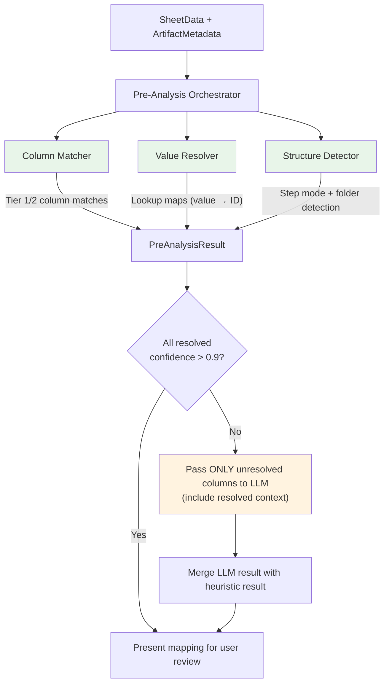
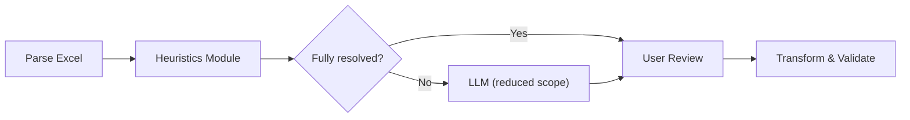

# Design Document: Heuristics Pre-Analysis Module

## Overview

The Heuristics Module is a deterministic pre-processing layer that runs between spreadsheet parsing and LLM invocation. It analyses source data structure and values against Spira template metadata, resolving column mappings, value translations, and structural patterns without any network calls or LLM usage.

The module follows a tiered confidence model:
- **Tier 1** (confidence ≥ 0.95): Deterministic — exact matches, regex, direct lookups
- **Tier 2** (confidence 0.7–0.94): Heuristic — fuzzy matching, pattern inference
- **Tier 3** (confidence < 0.7 or unresolvable): Deferred to LLM

When all columns resolve at Tier 1/2, the LLM call is skipped entirely.

## Architecture



### Pipeline Integration Point



## Components

### 1. Column Matcher (`src/heuristics/column-matcher.ts`)

Matches source column headers to Spira field definitions using progressively looser strategies.

```typescript
interface ColumnMatch {
  sourceColumn: string;
  targetField: string;
  confidence: number;
  tier: 1 | 2 | 3;
  matchReason: string;
}

interface ColumnMatchResult {
  matches: ColumnMatch[];
  unmatched: string[];
  ambiguous: { sourceColumn: string; candidates: ColumnMatch[] }[];
}
```

**Matching strategies (applied in priority order, first match wins):**

| Priority | Strategy | Confidence | Example |
|----------|----------|-----------|---------|
| 1 | Exact match (case-insensitive) | 1.0 | "Name" → Name |
| 2 | Known alias table | 0.98 | "Title" → Name, "Prio" → Priority |
| 3 | Prefix/suffix strip | 0.95 | "Test Case Name" → Name |
| 4 | Custom property name match | 1.0 | "Automation Status" → CP#1 |
| 5 | Normalised Levenshtein (> 0.8) | similarity | "Descrption" → Description |
| 6 | Contains match | 0.75 | "Step Description" → step-related |

**Known alias table (extensible):**

```typescript
const FIELD_ALIASES: Record<string, string[]> = {
  'Name': ['name', 'title', 'test name', 'tc name', 'test case name', 'test case title', 'scenario'],
  'Description': ['description', 'desc', 'details', 'summary', 'objective'],
  'TestCasePriorityId': ['priority', 'prio', 'importance', 'severity', 'criticality'],
  'TestCaseStatusId': ['status', 'state', 'workflow status'],
  'TestCaseTypeId': ['type', 'test type', 'tc type', 'category', 'classification'],
  'OwnerId': ['owner', 'assigned to', 'assignee', 'tester', 'responsible'],
  'ComponentIds': ['component', 'module', 'area', 'subsystem', 'feature area'],
  'Tags': ['tag', 'tags', 'label', 'labels', 'keyword', 'keywords'],
};

const FOLDER_ALIASES: string[] = ['folder', 'path', 'folder path', 'group', 'section', 'hierarchy'];
const STEP_DESCRIPTION_ALIASES: string[] = ['step description', 'step desc', 'action', 'test step', 'step action', 'steps'];
const STEP_EXPECTED_ALIASES: string[] = ['expected result', 'expected', 'expected outcome', 'verification', 'then'];
const STEP_NUMBER_ALIASES: string[] = ['step #', 'step no', 'step number', 'step num', '#', 'no.'];
```

### 2. Value Resolver (`src/heuristics/value-resolver.ts`)

Resolves source values to Spira entity IDs by matching against template metadata.

```typescript
interface ValueResolutionResult {
  lookupMaps: Map<string, Record<string, number>>;
  unresolvedValues: { field: string; sourceValue: string }[];
  resolutionLog: { field: string; sourceValue: string; resolvedTo: string; confidence: number }[];
}
```

**Resolution strategies (applied in priority order):**

| Priority | Strategy | Confidence | Example |
|----------|----------|-----------|---------|
| 1 | Exact match (case-insensitive) | 1.0 | "High" → "High" (ID 2) |
| 2 | Strip numeric prefix `/^\d+\s*[-–—:.\)]\s*/` | 0.95 | "2 - High" → "High" → ID 2 |
| 3 | Source is substring of target | 0.85 | "Med" matches "3 - Medium" |
| 4 | Target is substring of source | 0.8 | "Medium Priority" → "Medium" |
| 5 | Levenshtein (normalised distance < 0.3) | 1 - dist | "Meedium" → "Medium" |

**Implementation notes:**
- Collect unique values per lookup column first (avoid redundant matching)
- Build the lookup map once per field, not per row
- For users: match against both `fullName` and `userName`
- For custom lists: match against list values for the specific custom property's list ID

### 3. Structure Detector (`src/heuristics/structure-detector.ts`)

Detects spreadsheet layout patterns that affect row interpretation.

```typescript
interface StepStructure {
  mode: 'separate-rows' | 'inline' | 'none';
  confidence: number;
  // Separate-rows
  groupingColumn?: string;
  stepNumberColumn?: string;
  stepDescriptionColumn?: string;
  stepExpectedResultColumn?: string;
  // Inline
  inlineColumn?: string;
  inlineDelimiter?: 'numbered-dot' | 'step-prefix' | 'bullet' | 'semicolon' | 'newline';
}

interface FolderStructure {
  detected: boolean;
  column?: string;
  separator?: string;
  confidence: number;
}

interface StructureDetectionResult {
  stepStructure: StepStructure;
  folderStructure: FolderStructure;
}
```

#### Separate-Rows Detection Algorithm

```
1. For each column C:
   - uniqueRatio = uniqueValues(C).size / totalRows
   - If uniqueRatio < 0.5 → candidate grouping column

2. For each candidate grouping column G:
   - Find adjacent column N where:
     - All values are integers
     - Values reset to 1 when G changes
     - Values increment sequentially within each G-group
   - If found → SEPARATE-ROWS confirmed (confidence based on consistency)

3. Identify step content columns:
   - Column immediately after N (or named "Step Description") → stepDescriptionColumn
   - Column named with STEP_EXPECTED_ALIASES → stepExpectedResultColumn
```

#### Inline Step Detection Algorithm

```
1. For each text column with avg cell length > 80 chars:
   - Sample min(10, rowCount) cells

2. Apply pattern recognizers to each sample:
   - numbered-dot:  /^\s*\d+[\.\)]\s+.+/m  (multiline)
   - step-prefix:   /^\s*Step\s+\d+\s*[:\-–]\s*/mi
   - bullet:        /^\s*[•●○◦\-\*]\s+.+/m
   - semicolon:     split by /;\s*/ yields 3+ non-empty segments

3. If ≥ 60% of samples match the same pattern → inline mode
   - Record the delimiter type
   - Confidence = match percentage

4. Disambiguation: If segments average < 200 chars and ≥ 3 per cell → steps
   If segments average > 200 chars or < 3 → probably just multiline text
```

#### Folder Detection Algorithm

```
1. For each column:
   - Count values containing path separators: / \ > → ::
   - If > 50% of non-empty values contain the same separator → folder candidate

2. Secondary signal:
   - Values form a tree (share common prefixes at varying depths)
   - Column name matches FOLDER_ALIASES

3. Rank candidates by: separator prevalence × name match bonus
```

### 4. Pre-Analysis Orchestrator (`src/heuristics/index.ts`)

Coordinates all heuristic components and produces the final result.

```typescript
interface PreAnalysisResult {
  /** Column mappings resolved by heuristics (Tier 1 and 2) */
  resolvedMappings: ColumnMatch[];
  /** Value lookup maps for resolved lookup fields */
  valueLookups: Map<string, Record<string, number>>;
  /** Detected spreadsheet structure */
  structure: StructureDetectionResult;
  /** Columns that need LLM assistance */
  unresolvedColumns: string[];
  /** Values that couldn't be matched */
  unresolvedValues: { field: string; sourceValue: string }[];
  /** Whether heuristics resolved everything (LLM can be skipped) */
  fullyResolved: boolean;
  /** Human-readable summary */
  summary: string;
}

interface PreAnalysisConfig {
  fieldDefinitions: FieldDefinition[];
  metadata: ArtifactMetadata;
}

function analyzeSpreadsheet(
  sheet: SheetData,
  config: PreAnalysisConfig,
): PreAnalysisResult;
```

**Orchestration flow:**

```
1. Run Structure Detector → identify step mode + folder column
2. Run Column Matcher → resolve column-to-field mappings
   - Exclude columns already claimed by structure detection (step number, step desc, etc.)
3. Run Value Resolver → for each resolved lookup column, build source-value → ID map
4. Compute fullyResolved: all columns either matched (confidence > 0.9) or structurally accounted for
5. Build summary string for CLI display
```

### 5. LLM Prompt Enhancement

When the LLM is needed (not fully resolved), the prompt includes pre-analysis context:

```
## Pre-Analysis Results (already resolved — do not override unless incorrect)

The following columns have been matched with high confidence:
- "Name" → Name (exact match, confidence 1.0)
- "Priority" → TestCasePriorityId (alias match, confidence 0.98)
- "Description" → Description (exact match, confidence 1.0)

The following values have been resolved:
- Priority: "Medium" → ID 3, "High" → ID 2, "Low" → ID 4

Structure detected:
- Separate-rows test step mode (grouping by "Id" column, step number in "Test Step #")

## Your Task

Map ONLY these remaining columns:
- "Transaction" — 15 unique values, samples: "VA01", "VL01n", "ZV_SDLODIST"
- "Attachments" — contains file references

For each, decide: which Spira field does it map to, or should it be ignored?
```

This drastically reduces the LLM's scope and prevents it from overriding correct heuristic decisions.

## Future: Mapping Vectors (RAG Layer)

Once multiple successful imports have been completed, we can build a retrieval layer:

1. **After user approval**, persist the final confirmed mapping as a "mapping record":
   - Source column headers + sample values
   - Confirmed target field assignments
   - Source tool/format metadata (e.g., "HP ALM export", "Jira CSV")

2. **Embed mapping records** as vectors (column header patterns + value patterns → target field)

3. **Before heuristics run**, retrieve similar past mappings by:
   - Embedding the current source column headers
   - Finding nearest-neighbor mapping records
   - Feeding those as "precedent" context to Tier 2 or Tier 3

4. **Feedback loop**: when a user corrects a mapping, the correction overwrites the stored vector, improving future accuracy

This creates a system that gets smarter over time — learning from every customer's import. But it's an additive layer on top of the heuristic foundation, not a replacement for it.

## Performance Characteristics

| Operation | Expected time (1000 rows) |
|-----------|--------------------------|
| Column matching | < 1ms |
| Structure detection | < 50ms (column stats + sampling) |
| Value resolution | < 100ms (unique value extraction + matching) |
| Total pre-analysis | < 200ms |

No network calls. No LLM tokens. Pure in-process computation.

## Error Handling

The heuristics module never throws — it degrades gracefully:
- If column matching fails completely → all columns marked as unresolved → full LLM mode (existing behavior)
- If value resolution finds no matches → lookup maps are empty → LLM builds them
- If structure detection is inconclusive → mode = 'none' → LLM asked about step layout

The module adds value when it works but never blocks the pipeline when it doesn't.
