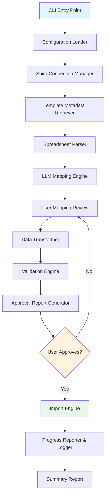
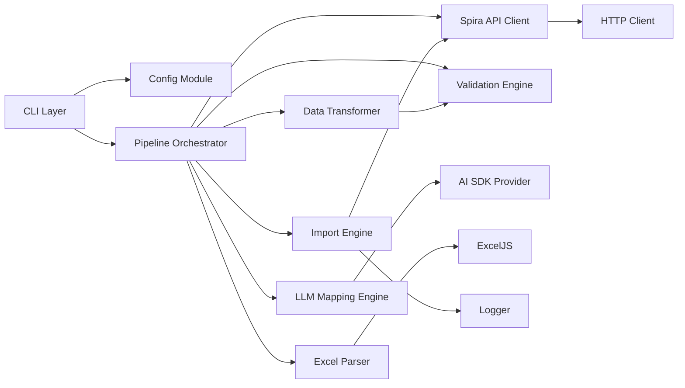

# Design Document: LLM Test Case Importer

## Overview

The LLM Test Case Importer is a standalone Node.js/TypeScript CLI tool that bridges arbitrary Excel-based test case data with Spira's structured data model using LLM-assisted mapping. The tool operates as a multi-phase pipeline:

1. **Connect** — Authenticate against a Spira instance and retrieve template metadata
2. **Parse** — Extract raw data from customer-provided Excel spreadsheets
3. **Map** — Use a customer-chosen LLM to propose column/value mappings from source data to Spira's schema
4. **Transform & Validate** — Apply confirmed mappings, validate against the Spira schema, and generate an approval report
5. **Import** — Inject validated test cases into Spira via the REST API

The tool is **not** a SpiraApp (browser plugin). It runs locally on the customer's machine, stores no credentials persistently, and supports OpenAI, Anthropic, and AWS Bedrock as LLM providers.

### Key Design Decisions

- **Vercel AI SDK** for multi-provider LLM abstraction with structured output (Zod schemas). This gives us a unified API across OpenAI, Anthropic, and AWS Bedrock with built-in structured JSON generation via `generateObject`.
- **ExcelJS** for spreadsheet parsing — mature, TypeScript-typed, supports .xlsx and .xls formats.
- **Zod** for runtime schema validation throughout the pipeline — validates LLM responses, user configuration, and transformed data.
- **Commander.js** for CLI argument parsing.
- **Inquirer.js** for interactive user prompts (worksheet selection, mapping review, go/no-go approval).

## Architecture

The system follows a pipeline architecture with clear phase boundaries. Each phase produces an intermediate result consumed by the next phase. This enables dry-run mode (stop before import), retry at any phase, and clear error attribution.



### Component Dependency Diagram



## Components and Interfaces

### 1. Configuration Module (`src/config/`)

Responsible for loading and validating all configuration: Spira credentials, LLM provider settings, and CLI options.

```typescript
interface SpiraConfig {
  baseUrl: string;          // Spira instance URL
  username: string;         // Spira username
  apiKey: string;           // Spira RSS/API token
  projectId: number;        // Target project ID
}

interface LLMConfig {
  provider: 'openai' | 'anthropic' | 'bedrock';
  model: string;            // e.g., "gpt-4o", "claude-sonnet-4-20250514", "us.anthropic.claude-sonnet-4-20250514-v1:0"
  apiKey?: string;          // For OpenAI/Anthropic
  region?: string;          // For AWS Bedrock
  temperature?: number;     // Default: 0.0 for deterministic mapping
}

interface ImporterConfig {
  spira: SpiraConfig;
  llm: LLMConfig;
  sourceFile: string;       // Path to Excel file
  dryRun: boolean;          // If true, stop before API injection
  logFile?: string;         // Custom log output path
}
```

### 2. Spira API Client (`src/spira/`)

Encapsulates all communication with the Spira REST API v7.0. Handles authentication, rate limiting, and error mapping.

```typescript
interface SpiraApiClient {
  // Connection
  authenticate(): Promise<void>;
  
  // Template metadata retrieval
  getCustomProperties(artifactTypeName: string): Promise<CustomPropertyDefinition[]>;
  getCustomListValues(customListId: number): Promise<CustomListValue[]>;
  getTestCasePriorities(): Promise<TestCasePriority[]>;
  getTestCaseStatuses(): Promise<TestCaseStatus[]>;
  getTestCaseTypes(): Promise<TestCaseType[]>;
  getProjectUsers(): Promise<ProjectUser[]>;
  getComponents(): Promise<Component[]>;
  
  // Folder management
  getTestFolders(): Promise<TestCaseFolder[]>;
  createTestFolder(folder: CreateFolderRequest): Promise<TestCaseFolder>;
  
  // Test case creation
  createTestCase(testCase: CreateTestCaseRequest): Promise<TestCaseResponse>;
  addTestSteps(testCaseId: number, steps: CreateTestStepRequest[]): Promise<void>;
}
```

**Authentication**: Uses Basic Auth with `username` and API key (base64-encoded `username:api_key` in the Authorization header), as per the Spira REST API spec.

**Key Endpoints Used**:
| Operation | Method | Path |
|-----------|--------|------|
| Validate connection | GET | `/projects/{project_id}` |
| Custom properties | GET | `/project-templates/{template_id}/custom-properties/TestCase` |
| Custom list values | GET | `/project-templates/{template_id}/custom-lists/{list_id}` |
| Priorities | GET | `/project-templates/{template_id}/test-cases/priorities` |
| Statuses | GET | `/project-templates/{template_id}/test-cases/statuses` |
| Types | GET | `/project-templates/{template_id}/test-cases/types` |
| Project users | GET | `/projects/{project_id}/users` |
| Test folders | GET | `/projects/{project_id}/test-folders` |
| Create folder | POST | `/projects/{project_id}/test-folders` |
| Create test case | POST | `/projects/{project_id}/test-cases` |
| Add test steps | POST | `/projects/{project_id}/test-cases/{id}/test-steps/multiple` |

### 3. Excel Parser (`src/parser/`)

Extracts structured data from customer spreadsheets while preserving full fidelity.

```typescript
interface ParsedSpreadsheet {
  fileName: string;
  sheets: SheetData[];
}

interface SheetData {
  name: string;
  headers: string[];         // Column headers from first row
  rows: Record<string, unknown>[];  // Each row as header->value map
  rowCount: number;
}

interface ExcelParser {
  parse(filePath: string): Promise<ParsedSpreadsheet>;
  getSampleRows(sheet: SheetData, count: number): Record<string, unknown>[];
}
```

### 4. LLM Mapping Engine (`src/mapping/`)

Constructs prompts from template metadata and source data, sends to the configured LLM provider via the Vercel AI SDK, and parses the structured mapping response.

```typescript
interface FieldMapping {
  sourceColumn: string;       // Column header from spreadsheet
  targetField: string;        // Spira field name (e.g., "Name", "Description", "TestCasePriorityId")
  transformType: 'direct' | 'lookup' | 'template' | 'ignore';
  lookupMap?: Record<string, number | string>;  // Source value -> Spira value/ID mapping
  templatePattern?: string;   // For combining multiple source columns
}

interface MappingResult {
  fieldMappings: FieldMapping[];
  testStepMapping?: TestStepMappingConfig;
  folderMapping?: FolderMappingConfig;
  confidence: number;         // 0-1 confidence score from LLM
  unmappedSourceColumns: string[];
  unmappedTargetFields: string[];
  notes: string[];            // LLM-generated notes about ambiguities
}

interface TestStepMappingConfig {
  mode: 'inline' | 'separate-rows' | 'none';
  descriptionColumn?: string;
  expectedResultColumn?: string;
  sampleDataColumn?: string;
  stepDelimiter?: string;     // For inline mode (e.g., newline-separated steps)
}

interface FolderMappingConfig {
  sourceColumn: string;
  pathSeparator: string;      // e.g., "/" or "\"
}

interface LLMMappingEngine {
  generateMapping(
    sourceData: SheetData,
    templateMetadata: TemplateMetadata,
    sampleRowCount?: number
  ): Promise<MappingResult>;
  
  retryMapping(
    previousResult: MappingResult,
    userFeedback: string
  ): Promise<MappingResult>;
}
```

The LLM prompt includes:
- Complete Spira field definitions with types and constraints
- All custom property definitions with their list values
- Source column headers with 3-5 sample data rows
- Instructions to produce a structured JSON mapping conforming to the `MappingResult` Zod schema

The Vercel AI SDK's `generateObject` function constrains the LLM output to match our Zod schema, eliminating the need for manual JSON parsing or retry on malformed responses.

### 5. Data Transformer (`src/transformer/`)

Applies the confirmed mapping to all source rows, producing Spira-ready objects.

```typescript
interface TransformedTestCase {
  sourceRowIndex: number;     // For error tracing
  name: string;
  description?: string;
  testCasePriorityId?: number;
  testCaseStatusId?: number;
  testCaseTypeId?: number;
  ownerId?: number;
  componentIds?: number[];
  customProperties: CustomPropertyValue[];
  testSteps: TransformedTestStep[];
  folderPath?: string;
  tags?: string;
}

interface TransformedTestStep {
  description: string;
  expectedResult?: string;
  sampleData?: string;
  position: number;
}

interface CustomPropertyValue {
  propertyNumber: number;     // 1-30 (Spira's custom property slots)
  value: string | number | boolean | null;
}

interface DataTransformer {
  transform(
    rows: Record<string, unknown>[],
    mapping: MappingResult,
    metadata: TemplateMetadata
  ): TransformationResult;
}

interface TransformationResult {
  testCases: TransformedTestCase[];
  errors: TransformationError[];
  warnings: TransformationWarning[];
}
```

### 6. Validation Engine (`src/validator/`)

Validates transformed test cases against Spira schema constraints.

```typescript
interface ValidationError {
  rowIndex: number;
  field: string;
  message: string;
  severity: 'error' | 'warning';
}

interface ValidationResult {
  isValid: boolean;
  errors: ValidationError[];
  warnings: ValidationError[];
  stats: {
    totalTestCases: number;
    validTestCases: number;
    totalTestSteps: number;
    errorCount: number;
    warningCount: number;
  };
}

interface ValidationEngine {
  validate(
    testCases: TransformedTestCase[],
    metadata: TemplateMetadata
  ): ValidationResult;
}
```

Validation rules:
- Required fields: `Name` must be non-empty
- `TestCaseStatusId` and `TestCaseTypeId` must reference valid template values
- `TestCasePriorityId` (if set) must reference an active priority
- `OwnerId` (if set) must reference an active project member
- Custom list values must match active entries in the corresponding custom list
- Custom property values must match the expected type (text, integer, decimal, boolean, date, list, multiselect)

### 7. Import Engine (`src/importer/`)

Manages API injection with progress tracking, error handling per-record, and folder hierarchy creation.

```typescript
interface ImportResult {
  totalAttempted: number;
  successCount: number;
  failureCount: number;
  failures: ImportFailure[];
  createdFolders: string[];
  duration: number;           // milliseconds
}

interface ImportFailure {
  sourceRowIndex: number;
  testCaseName: string;
  error: string;
  phase: 'folder' | 'testcase' | 'teststep';
}

interface ImportEngine {
  import(
    testCases: TransformedTestCase[],
    options: { dryRun: boolean; onProgress: ProgressCallback }
  ): Promise<ImportResult>;
}

type ProgressCallback = (current: number, total: number, item: string) => void;
```

### 8. Logger (`src/logger/`)

Structured logging throughout the pipeline, persisted to file on completion.

```typescript
interface Logger {
  info(message: string, context?: Record<string, unknown>): void;
  warn(message: string, context?: Record<string, unknown>): void;
  error(message: string, context?: Record<string, unknown>): void;
  apiRequest(method: string, url: string, status: number, duration: number): void;
  persist(filePath: string): Promise<void>;
}
```

## Data Models

### Template Metadata (retrieved from Spira)

```typescript
interface TemplateMetadata {
  projectId: number;
  templateId: number;
  priorities: TestCasePriority[];
  statuses: TestCaseStatus[];
  types: TestCaseType[];
  customProperties: CustomPropertyDefinition[];
  customLists: Map<number, CustomListValue[]>;
  users: ProjectUser[];
  components: Component[];
  existingFolders: TestCaseFolder[];
}

interface TestCasePriority {
  priorityId: number;
  name: string;
  active: boolean;
  score: number;
}

interface TestCaseStatus {
  testCaseStatusId: number;
  name: string;
  active: boolean;
}

interface TestCaseType {
  testCaseTypeId: number;
  name: string;
  active: boolean;
  isDefault: boolean;
}

interface CustomPropertyDefinition {
  customPropertyId: number;
  propertyNumber: number;      // 1-30, the slot position
  name: string;
  artifactTypeName: string;
  customPropertyTypeId: number; // 1=Text, 2=Integer, 3=Decimal, 4=Boolean, 5=Date, 6=List, 7=MultiList, 8=User
  customPropertyTypeName: string;
  customListId?: number;       // For list/multilist types
  isRequired: boolean;
}

interface CustomListValue {
  customPropertyValueId: number;
  name: string;
  active: boolean;
}

interface ProjectUser {
  userId: number;
  fullName: string;
  userName: string;
  active: boolean;
}

interface Component {
  componentId: number;
  name: string;
  active: boolean;
}

interface TestCaseFolder {
  testCaseFolderId: number;
  name: string;
  parentTestCaseFolderId?: number;
  indentLevel: string;
}
```

### Spira REST API Request Bodies

```typescript
// POST /projects/{project_id}/test-cases
interface CreateTestCaseRequest {
  Name: string;
  Description?: string;
  TestCaseStatusId: number;    // Required — use 0 for default
  TestCaseTypeId?: number;     // Pass null to use default
  TestCasePriorityId?: number;
  OwnerId?: number;
  TestCaseFolderId?: number;   // null = root folder
  ComponentIds?: number[];
  Tags?: string;
  CustomProperties?: RemoteCustomProperty[];
}

// POST /projects/{project_id}/test-cases/{id}/test-steps/multiple
interface CreateTestStepRequest {
  Description: string;
  ExpectedResult?: string;
  SampleData?: string;
  Position: number;
}

// POST /projects/{project_id}/test-folders
interface CreateFolderRequest {
  Name: string;
  ParentTestCaseFolderId?: number;  // null = root
}

// Custom property value format for REST API
interface RemoteCustomProperty {
  PropertyNumber: number;
  StringValue?: string;
  IntegerValue?: number;
  BooleanValue?: boolean;
  DateTimeValue?: string;
  IntegerListValue?: number[];
}
```


## Correctness Properties

*A property is a characteristic or behavior that should hold true across all valid executions of a system — essentially, a formal statement about what the system should do. Properties serve as the bridge between human-readable specifications and machine-verifiable correctness guarantees.*

### Property 1: Authentication header round-trip

*For any* valid username string and API key string, the constructed HTTP Authorization header should be a valid Base64 encoding of `username:apiKey`, and decoding it should yield the original credentials.

**Validates: Requirements 1.2**

### Property 2: Spreadsheet data preservation

*For any* set of column headers and row data (strings, numbers, booleans, dates), writing the data to an Excel workbook and parsing it back with the Excel parser should produce a structure where every original value is accessible via its original column header and row index.

**Validates: Requirements 3.3**

### Property 3: LLM prompt completeness

*For any* combination of source column headers, sample rows, and template metadata (priorities, statuses, types, custom properties, custom lists), the constructed LLM prompt should contain every source column header, every custom property name, every custom list value name, and all standard field definitions.

**Validates: Requirements 5.1, 5.2**

### Property 4: Data transformation correctness

*For any* set of source rows and a valid confirmed mapping (with direct, lookup, and template transforms), the transformer should produce one TransformedTestCase per source row where each mapped field contains the correctly transformed value according to its transform type and lookup map.

**Validates: Requirements 5.7, 6.1**

### Property 5: Required field validation

*For any* TransformedTestCase, the validation engine reports an error if and only if the Name field is empty or missing. A test case with a non-empty Name and valid status/type should pass required-field validation.

**Validates: Requirements 6.2**

### Property 6: Custom list value validation

*For any* custom property of type "list" or "multilist" on a TransformedTestCase, the validation engine reports an error if and only if the property value does not match an active entry in the corresponding custom list from the template metadata.

**Validates: Requirements 6.3**

### Property 7: Validation report completeness

*For any* TransformationResult and ValidationResult, the generated Mapping_Validation_Report contains: the total test case count equal to `transformationResult.testCases.length`, at least one sample record (when test cases exist), error count matching `validationResult.errors.length`, warning count matching `validationResult.warnings.length`, and a non-empty field mapping summary.

**Validates: Requirements 6.5**

### Property 8: No API writes before approval

*For any* pipeline execution state where user approval has not been given, the number of mutating API calls (POST/PUT) to the Spira REST API is exactly zero.

**Validates: Requirements 6.8**

### Property 9: Custom property serialization correctness

*For any* custom property definition and corresponding value, the serialized `RemoteCustomProperty` object uses exactly one value field matching the property's type: `StringValue` for text, `IntegerValue` for integer/decimal, `BooleanValue` for boolean, `DateTimeValue` for date, and `IntegerListValue` for list/multiselect types.

**Validates: Requirements 7.3**

### Property 10: Resilient import with correct accounting

*For any* batch of N test cases where K arbitrary test cases fail during API creation, the importer still attempts all N test cases, and the resulting `ImportResult` satisfies: `successCount + failureCount == totalAttempted`, `failureCount == failures.length`, and each failure contains a valid `sourceRowIndex` and non-empty error message.

**Validates: Requirements 7.4, 7.5**

### Property 11: Dry-run zero API writes

*For any* input data and mapping processed with `dryRun: true`, the import engine makes exactly zero mutating HTTP requests to the Spira REST API.

**Validates: Requirements 7.6**

### Property 12: Folder resolution correctness

*For any* set of folder paths (e.g., "A/B/C", "A/B/D", "E"), the folder resolver creates all necessary folders forming a valid tree (each child has exactly one parent), and each test case with a folder path is assigned the `TestCaseFolderId` of the deepest folder in its path. Test cases with no folder path are assigned `TestCaseFolderId = null` (root).

**Validates: Requirements 8.1, 8.2, 8.4**

### Property 13: Folder reuse idempotence

*For any* folder path that already exists in the project's existing folder list, the folder resolver returns the existing folder's ID without creating a new folder. Running folder resolution twice for the same set of paths produces the same folder IDs and does not create duplicates.

**Validates: Requirements 8.3**

### Property 14: Interruption state accuracy

*For any* interruption at index K in a batch of N items, the logged state accurately reflects exactly which items (indices 0..K-1) were processed and which items (indices K..N-1) remain unprocessed, with no items missing or double-counted.

**Validates: Requirements 9.4**

## Error Handling

### Error Categories and Strategy

| Category | Source | Strategy |
|----------|--------|----------|
| Configuration errors | Invalid config, missing fields | Fail fast with clear message before pipeline starts |
| Connection errors | Network, auth failures | Fail fast with diagnostic info (status code, URL attempted) |
| Parse errors | Invalid Excel file | Fail fast with file path and error detail |
| LLM errors | Provider timeout, invalid response | Offer retry with same or modified prompt |
| Validation errors | Data doesn't match schema | Collect all errors, present in report, let user decide |
| Import errors | Per-record API failures | Log failure, continue with remaining records |
| Interruption | Process killed, network drops | Persist current state to log for recovery |

### Error Propagation

- **Phase 1-3** (Connect, Metadata, Parse): Errors are fatal — the pipeline cannot proceed without these foundations. Throw descriptive errors that terminate the process.
- **Phase 4** (LLM Mapping): Errors are recoverable — offer retry or prompt adjustment.
- **Phase 5** (Transform + Validate): Errors are accumulated per-row. The pipeline continues to collect all errors for the report.
- **Phase 6** (Import): Errors are per-record. One failure does not stop others. All failures are logged with source row reference.

### Retry Strategy

- **LLM calls**: Exponential backoff with 3 retries for transient failures (rate limits, timeouts). User-initiated retry for invalid responses.
- **Spira API calls**: Single retry with 2-second delay for 5xx responses. No retry for 4xx (data errors).

### Graceful Shutdown

On SIGINT/SIGTERM during import:
1. Complete the currently in-flight API request
2. Log all successfully imported items
3. Log all remaining unprocessed items
4. Persist the log file
5. Exit with non-zero code

## Testing Strategy

### Dual Testing Approach

This project uses both unit tests and property-based tests for comprehensive coverage:

- **Property-based tests** (via [fast-check](https://github.com/dubzzz/fast-check)): Verify universal properties across randomly generated inputs. Minimum 100 iterations per property.
- **Unit tests** (via Vitest): Verify specific examples, edge cases, integration wiring, and error conditions.
- **Integration tests**: Verify end-to-end flows with mocked Spira API and LLM provider.

### Property-Based Testing Configuration

- **Library**: fast-check (TypeScript, well-maintained, excellent Vitest integration)
- **Iterations**: Minimum 100 per property test
- **Tag format**: Each property test includes a comment: `// Feature: llm-test-case-importer, Property {N}: {title}`

### Test Coverage by Component

| Component | Property Tests | Unit Tests | Integration Tests |
|-----------|---------------|------------|-------------------|
| Config Module | — | Validation, defaults, env vars | — |
| Spira API Client | P1 (auth header) | Error handling, response parsing | End-to-end with mock server |
| Excel Parser | P2 (data preservation) | Format support, error cases | Fixture files |
| LLM Mapping Engine | P3 (prompt completeness) | Response parsing, retry flow | Mock AI provider |
| Data Transformer | P4 (transformation correctness) | Edge cases (empty rows, nulls) | — |
| Validation Engine | P5, P6 (required fields, list values) | All rule types | — |
| Report Generator | P7 (completeness) | Formatting | — |
| Import Engine | P8, P10, P11, P14 (safety, resilience, dry-run, interruption) | Progress callback | Mock API + scenarios |
| Custom Property Serializer | P9 (type correctness) | Each type variant | — |
| Folder Resolver | P12, P13 (hierarchy, idempotence) | Path parsing, edge cases | — |

### What Property Tests Cover vs Unit Tests

- **Property tests**: Universal invariants — "for all inputs satisfying X, property Y holds"
- **Unit tests**: Specific scenarios — error messages are human-readable, specific API error codes map to specific error types, UI prompts display correct options
- **Integration tests**: End-to-end pipeline with fixtures — "given this Excel file and this Spira template, the importer produces these test cases"
