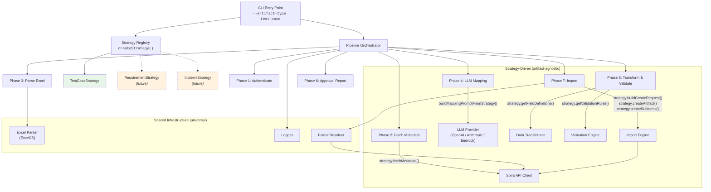

# SpiraTestCaseImporter

LLM-assisted artifact importer for Spira — uses heuristic pre-analysis and LLMs to map arbitrary Excel spreadsheets to Spira's data model.

## Quick Start

### 1. Install

```bash
npm install
npm run build
```

### 2. Configure

Create a `.env` file (see `.env.example`):

```env
SPIRA_URL=https://your-instance.spiraservice.net
SPIRA_USERNAME=your-username
SPIRA_API_KEY={YOUR-API-KEY-GUID}
SPIRA_PROJECT_ID=1

LLM_PROVIDER=bedrock
LLM_MODEL=amazon.nova-lite-v1:0
AWS_REGION=us-east-1
AWS_ACCESS_KEY_ID=AKIA...
AWS_SECRET_ACCESS_KEY=...

SOURCE_FILE=./your-spreadsheet.xlsx
```

Supported LLM providers: `bedrock` (AWS), `openai`, `anthropic`.

### 3. Run (dry-run first)

```bash
node --env-file=.env dist/cli.js --dry-run
```

For multi-sheet workbooks, specify the sheet:

```bash
node --env-file=.env dist/cli.js --sheet "Test Cases" --dry-run
```

### 4. What happens

1. Authenticates against your Spira instance
2. Fetches template metadata (priorities, statuses, types, custom properties, users, components)
3. Parses your Excel file
4. **Heuristic pre-analysis** — deterministically resolves column mappings, values, and structure
5. **LLM mapping** (only for columns the heuristics couldn't resolve)
6. Presents the proposed mapping for your review
7. Transforms and validates the data
8. Shows a validation report for go/no-go approval
9. Imports (or dry-runs) into Spira

### 5. CLI Options

All options can be set via environment variables (see above) or CLI flags:

| Flag | Env Var | Description |
|------|---------|-------------|
| `--source-file` | `SOURCE_FILE` | Path to Excel file |
| `--provider` | `LLM_PROVIDER` | `openai`, `anthropic`, or `bedrock` |
| `--model` | `LLM_MODEL` | Model name (e.g., `amazon.nova-lite-v1:0`) |
| `--spira-url` | `SPIRA_URL` | Spira instance URL |
| `--username` | `SPIRA_USERNAME` | Spira username |
| `--api-key` | `SPIRA_API_KEY` | Spira API key |
| `--project-id` | `SPIRA_PROJECT_ID` | Target project ID |
| `--region` | `AWS_REGION` | AWS region (Bedrock only) |
| `--sheet` | — | Worksheet name (skips selection prompt) |
| `--dry-run` | — | Validate without importing |
| `--artifact-type` | — | `test-case` (default), future: `requirement` |

## Documentation

- [Heuristic Pre-Analysis](docs/heuristics.md) — How deterministic matching works
- [LLM Mapping Strategy](docs/llm-mapping.md) — When and how the LLM is invoked
- [Spira Metadata](docs/spira-metadata.md) — What data is fetched and how it's normalised
- [Extending: New Artifact Types](docs/extending-artifacts.md) — Adding support for Requirements, Incidents, etc.

## Architecture

The tool operates as a multi-phase pipeline, parameterized by an **ArtifactStrategy** that makes it extensible to any Spira artifact type (test cases, requirements, incidents, etc.).



### How the Strategy Plugs In

Each pipeline component accepts an optional strategy configuration. When provided, artifact-specific behavior is delegated to the strategy. When absent, the built-in test case logic runs (backward compatible).

| Component | Strategy Hook | What It Controls |
|-----------|--------------|-----------------|
| Transformer | `fieldDefinitions` | Which target fields are standard vs custom properties |
| Validator | `externalRules` | Artifact-specific validation (required fields, valid lookups) |
| Importer | `strategy` | Request building, API creation, sub-item creation |
| Prompt Builder | `StrategyPromptConfig` | LLM prompt field tables, lookup values, sub-item instructions |
| Pipeline | `PipelineOptions.strategy` | Metadata fetching, wiring all of the above |

### Adding a New Artifact Type

```bash
spira-import --artifact-type requirement --source-file data.xlsx --provider openai --model gpt-4o
```

1. Create `src/strategies/requirement.strategy.ts` implementing `ArtifactStrategy`
2. Register it in `src/strategies/index.ts`
3. Done — the pipeline handles the rest
