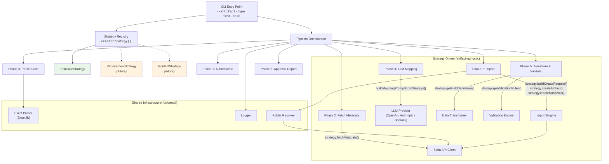

# SpiraTestCaseImporter
Using LLMs to reconcile customer Test Case data to Spira's data model on import

## Architecture

The tool operates as a multi-phase pipeline, parameterized by an **ArtifactStrategy** that makes it extensible to any Spira artifact type (test cases, requirements, incidents, etc.).



### How the Strategy Plugs In

Each pipeline component accepts an optional strategy configuration. When provided, artifact-specific behavior is delegated to the strategy. When absent, the built-in test case logic runs (backward compatible).

| Component | Strategy Hook | What It Controls |
|-----------|--------------|-----------------|
| Transformer | `fieldDefinitions` | Which target fields are standard vs custom properties |
| Validator | `externalRules` | Artifact-specific validation (required fields, valid lookups) |
| Importer | `strategy` | Request building, API creation, sub-item creation |
| Prompt Builder | `StrategyPromptConfig` | LLM prompt field tables, lookup values, sub-item instructions |
| Pipeline | `PipelineOptions.strategy` | Metadata fetching, wiring all of the above |

### Adding a New Artifact Type

```bash
spira-import --artifact-type requirement --source-file data.xlsx --provider openai --model gpt-4o
```

1. Create `src/strategies/requirement.strategy.ts` implementing `ArtifactStrategy`
2. Register it in `src/strategies/index.ts`
3. Done — the pipeline handles the rest
