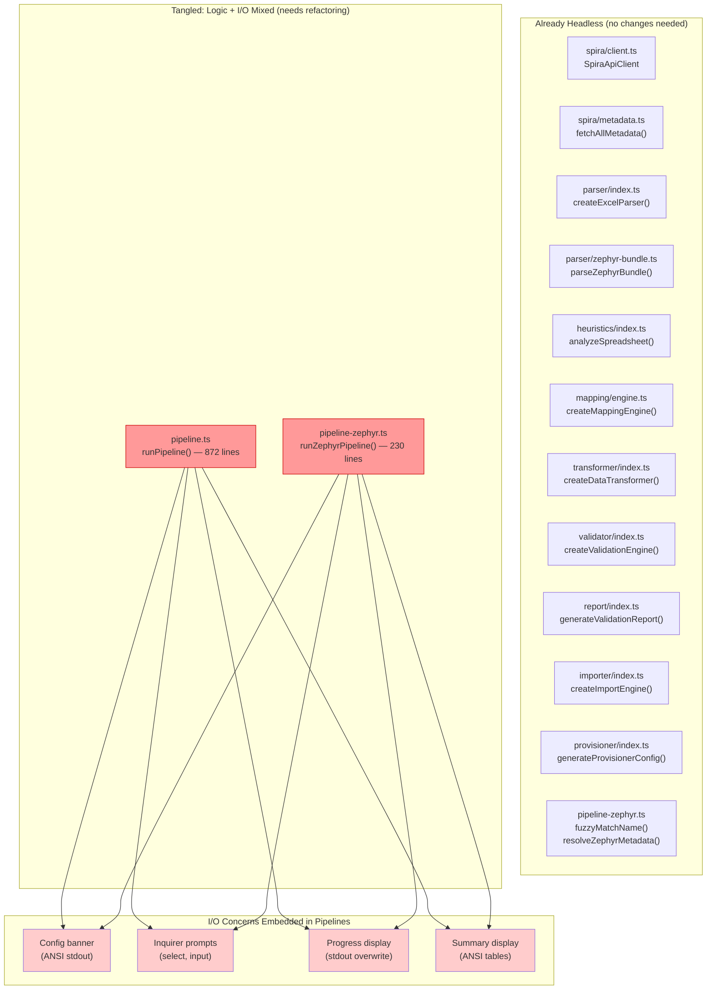
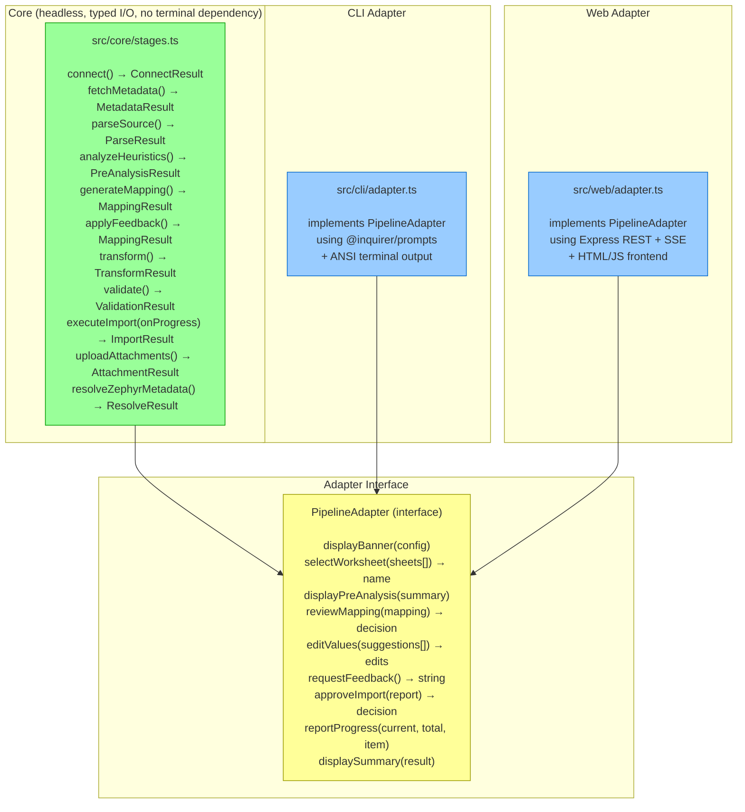

# Pipeline Refactor Plan: Core / Adapter Split

## Current State

## Target State

## Decision Points (where adapters interact)

| # | Decision | Input | Output |
|---|----------|-------|--------|
| 1 | Worksheet selection | `sheets: {name, rowCount, headers}[]` | `selectedSheet: string` |
| 2 | Mapping review | `MappingResult + preAnalysis` | `'accept' \| 'editValues' \| 'feedback' \| 'provisioner' \| 'abort'` |
| 2a | Edit values | `ValueSuggestion[]` | `edited ValueSuggestion[]` |
| 2b | Export provisioner | needs program name + product name | `{programName, productName}` |
| 2c | Feedback | (free text prompt) | `string` |
| 3 | Import approval | `ValidationReport + stats` | `'proceed' \| 'revise' \| 'abort'` |
| 3a | Revision feedback | (free text prompt) | `string` |
| 4 | Zephyr approval | `validation stats + warnings` | `'proceed' \| 'abort'` |

## What Stays, What Moves

### Stays in place (already correct)
- `src/spira/client.ts` — headless HTTP client
- `src/spira/metadata.ts` — headless metadata fetch
- `src/parser/index.ts` — headless Excel parser
- `src/parser/zephyr-bundle.ts` — headless Zephyr parser
- `src/heuristics/index.ts` — headless analysis
- `src/mapping/engine.ts` — headless LLM mapping
- `src/transformer/index.ts` — headless data transform
- `src/validator/index.ts` — headless validation
- `src/report/index.ts` — headless report generation (returns string)
- `src/importer/index.ts` — headless import engine (progress via callback)
- `src/provisioner/index.ts` — headless config generation
- `src/types/*` — all type definitions

### Moves / Refactors

| Current Location | Moves To | Nature of Change |
|-----------------|----------|-----------------|
| `pipeline.ts` — orchestration logic | `src/core/orchestrator.ts` | Strip I/O, accept `PipelineAdapter` |
| `pipeline.ts` — `convertPreAnalysisToMapping()` | `src/core/orchestrator.ts` | Already pure, just relocate |
| `pipeline.ts` — `mergeLookupMaps()` | `src/core/orchestrator.ts` | Already pure, just relocate |
| `pipeline.ts` — `processValueSuggestions()` | `src/core/orchestrator.ts` | Already pure, just relocate |
| `pipeline.ts` — `displayMappingSummary()` | CLI adapter | Terminal-only presentation |
| `pipeline.ts` — `displayImportSummary()` | CLI adapter | Terminal-only presentation |
| `pipeline.ts` — all `select()`/`input()` calls | Adapter interface calls | Becomes `await adapter.reviewMapping(...)` etc. |
| `pipeline.ts` — ANSI banner | CLI adapter `displayBanner()` | Terminal-only |
| `pipeline-zephyr.ts` — `runZephyrPipeline()` | `src/core/orchestrator.ts` (Zephyr path) | Strip I/O, share adapter |
| `pipeline-zephyr.ts` — `fuzzyMatchName()` | `src/core/fuzzy-match.ts` | Already pure, extract to own module |
| `pipeline-zephyr.ts` — `resolveZephyrMetadata()` | `src/core/zephyr-resolver.ts` | Already pure, extract to own module |
| `src/cli.ts` | `src/cli/index.ts` | Thin: create CLI adapter, call orchestrator |

### New Files

| File | Purpose |
|------|---------|
| `src/core/orchestrator.ts` | Pipeline stage orchestration — calls modules + adapter at decision points |
| `src/core/fuzzy-match.ts` | Extracted fuzzy name matcher (already exported, just needs own file) |
| `src/core/zephyr-resolver.ts` | Extracted Zephyr metadata resolver |
| `src/core/types.ts` | `PipelineAdapter` interface + stage result types |
| `src/cli/adapter.ts` | CLI adapter — inquirer + ANSI output |
| `src/web/server.ts` | Express server |
| `src/web/adapter.ts` | Web adapter — translates HTTP ↔ adapter interface |
| `src/web/public/` | HTML/JS/CSS frontend |

## Estimated Effort

The refactor is primarily mechanical:
1. Define `PipelineAdapter` interface (1 file, ~50 lines)
2. Extract orchestration from `pipeline.ts` into `core/orchestrator.ts` (move logic, replace I/O with adapter calls)
3. Create `cli/adapter.ts` using existing display/prompt code (move, don't rewrite)
4. Verify everything still works via CLI
5. Build web adapter + frontend

Steps 1–4 are ~2 hours of focused work. The existing tests don't touch the pipeline orchestrator (they test the headless modules directly), so the refactor carries low regression risk.
